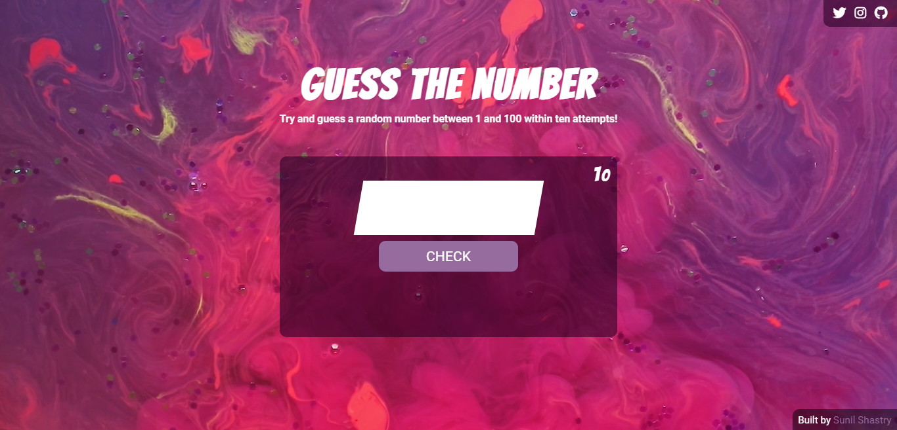
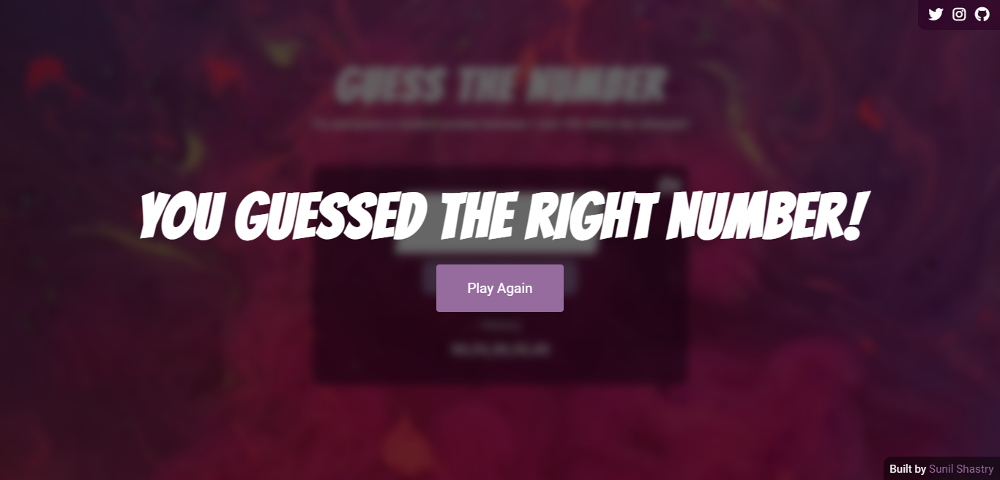
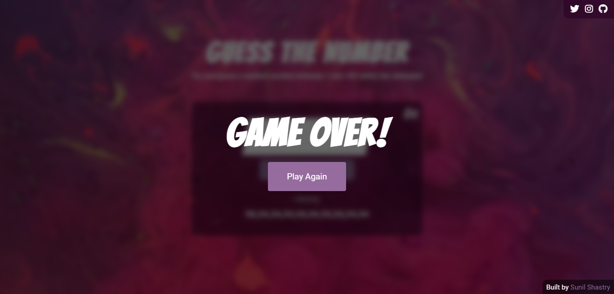

# Guess the Number

## By [Sunil Shastry](https://www.sunilshastry.com/ "Sunil Shastry").

---

_**Guess the Number** is a simple game where the user has to guess the random number generated between 1 & 100, by the computer within ten chances. (Don't worry! Some vital hints are provided. It's easier than it sounds)_

---

### How to play?

- Access the website by visiting [Guess the Number](https://guessthenumberapp.netlify.app/ "Seconds").

- Please wait for the web application to load.

- When loaded, the browser generates a random number between one and hundred (1 - 100).

- Your task is to identify that number, try your luck in guessing the right number, do know that the number generated is between 1 and 100 only.

- You are provided with ten chances to guess the number, and on each guess your number of chances reduce.

- And with each guess, there is also a history "History" tab which updates and displays your previous inputs, in order to keep a record of all your guesses.

- On guessing the correct number generated by the computer, a notification popup will automatically appear stating your victory, you can opt to play again.

- And by not guessing the correct number within ten chances, a notification popup will be displayed on your screen. You can try your luck again by clicking the "Play Again" button.

---

### **Credits & Shoutouts**

Credit to [Coverr](https://coverr.co/) for their high-quality free videos and [FontAwesome](https://fontawesome.com/) for their free font-icons.

### **Want to know more about me?**

_If you wish to know more about me and the projects I've developed and designed, or simply contact me for any queries:_

Visit my [Portfolio Website](https://www.sunilshastry.com/ "Portfolio").

or, contact me on [Twitter](https://twitter.com/sunillshastry/ "Sunil on Twitter").

**Thank you for visiting my GitHub repository, have a great day!**
